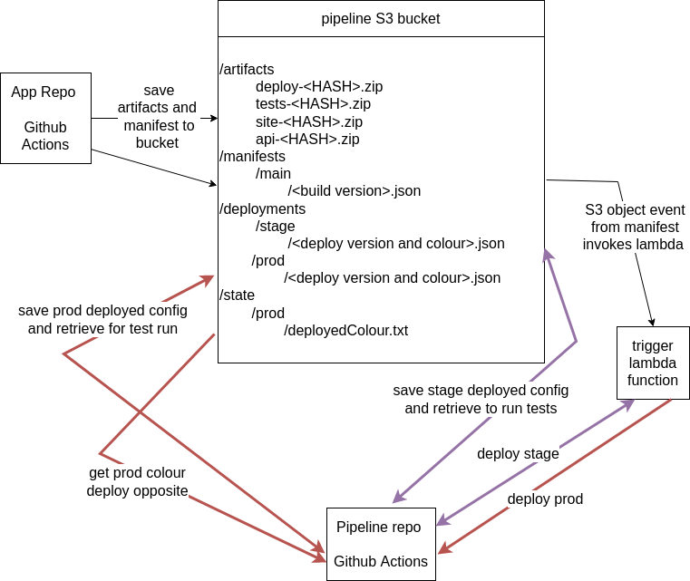

# guitarapp-pipeline

## pipeline bucket structure

/artifacts/
- |name|-|hash|.zip

/manifests/|branch|
- |buildnumber|.json

/deployments/|env|/
- |deploymenttime|-|buildnumber|-|colour|.json

/reports/|env|/
- |deploymenttime|-|buildnumber|-|colour|.json.html

/state/
- githubToken.txt
/state/|env|/
- deployedColour.txt

## pipeline workflow

The app repository github action workflow builds artifacts into `.zip` files and then uploads them to the `artifacts` prefix in the S3 bucket. It also uploads a manifest file to the `manifests` prefix. 

The manifest object creation invokes a lambda function, which might trigger a [manual workflow](https://docs.github.com/en/rest/reference/actions#create-a-workflow-dispatch-event) in the pipeline repository.

If the manifest is from the `main` branch then a deployment will be started on the `stage` environment. If the deployment and functional tests pass, then the trigger lambda will be invoked again which will promote the deployment to the `prod` environment with the opposite colour of the contents of `<pipeline>/state/prod/deployedColour.txt`.

Once deployed the trigger lambda can be run manually to deploy to specific environments and colours.

## Getting started

To bootstrap the project, go to the github actions tab and run the `Bootstrap pipeline` workflow.

This needs to be done once manually and isn't part of the CI/CD. Further CDK actions will be done as part of the pipeline.

### Secrets

Once the pipeline is bootstrapped need to add the following secrets to the pipeline repo:

 name | value |
 ---- | ----- |
 PIPELINE_GITHUB_TOKEN | Generate a secret that has permission to start workflows and add. |
 PIPELINE_AWS_ACCOUNT | AWS account number, currently all code is designed to deploy to same account. |
 DEPLOY_ACCESS_KEY_ID | Create credential from bootstrapped deploy user. |
 DEPLOY_SECRET_ACCESS_KEY | Create credential from bootstrapped deploy user. |
 
After these are added the pipeline will be deployable from github actions.